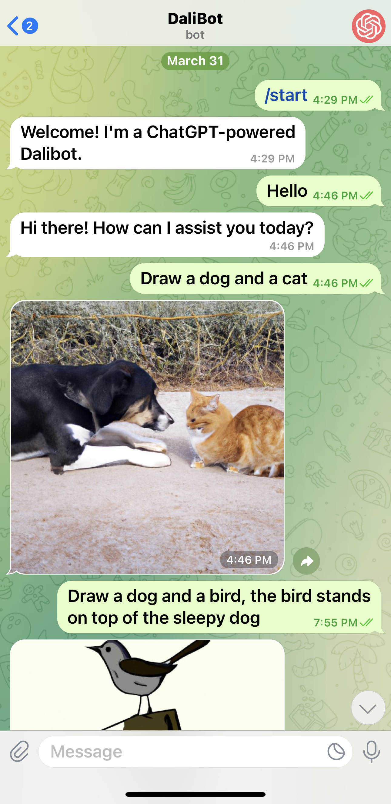

# DaliBot

Welcome to DaliBot! This is a Telegram bot powered by OpenAI's GPT-4 model, ChatGPT. This bot facilitates dynamic and human-like conversation right within Telegram.




## Setup Guide

### Prerequisites

To set up DaliBot, you will need a few things:

* A Telegram token
* An OpenAI token
* Python 3

#### Obtaining a Telegram token

To get a Telegram token, you will need to create a new bot in Telegram. This can be done by following this [guide](https://core.telegram.org/bots#how-do-i-create-a-bot).

#### Obtaining an OpenAI token

You can request an OpenAI token from the [OpenAI website](https://www.openai.com).

#### Verifying Python 3 installation

To check if you have Python 3 installed, run the following command in your terminal:

```bash
python3 --version
```

If Python 3 is installed, this command will output the version number. The recommended version is 3.10 or newer. If it's not installed, please install it from the [official website](https://www.python.org/downloads/).

### Setting the Tokens as Environment Variables

Once you have both the Telegram and OpenAI tokens, you need to set them as environment variables. Here's how you can do it:

Create a file under project root called .env and add your tokens there like:

```bash
TELEGRAM_TOKEN="your_telegram_token"
OPENAI_TOKEN="your_openai_token"
```

### Building the Program

First, ensure you're in the correct folder directory. Then, execute the following command to install dependencies:

```bash
pip3 install -r requirements.txt
```

Depends on your local machine, it could be *pip* instead of *pip3*.

### Running the App Locally

Execute the following command:

```bash
python3 source/main.py [--use-local]
```

Depends on your local machine, it could be *python* instead of *python3*. Your DaliBot should now be up and running!

Make sure your bot runs locally before deploying it.

### Deploying the App

If everything looks fine when you run the app locally, you may consider deploying it so that the Bot can be accessed 24/7. 

Heroku is used to deploy the app but other cloud providers like AWS should work out of the box. Go to www.heroku.com and follow the instructions there. Eventually, you add your heroku domain as an environment variable like this:

```bash
HEROKU_DOMAIN="https://example.herokuapp.com"

## Troubleshoot

You can debug the app in vscode if anything goes wrong. The debug configuration is in .vscode/launch.json and is ready for use.

## API References

For more details on the APIs used in this project, please refer to the following resources:

* [OpenAI API](https://platform.openai.com/docs/introduction/overview)
* [Telegram Bot API](https://github.com/python-telegram-bot/python-telegram-bot/wiki/Extensions---Your-first-Bot)
